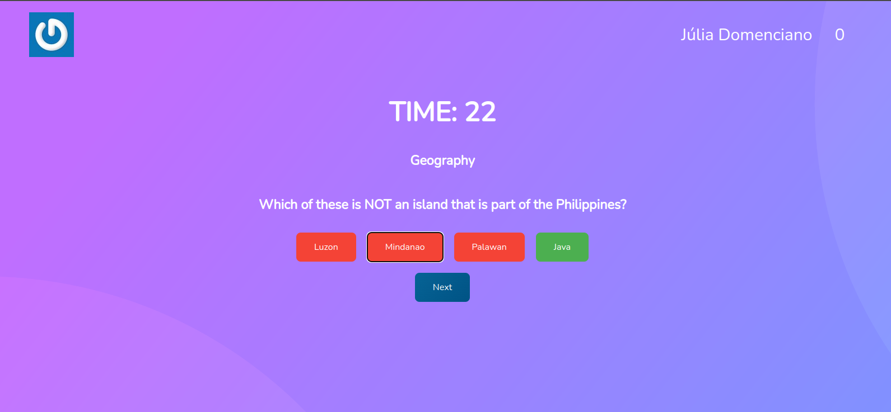

# Project Trivia!

## Description

Project developed by [Júlia Domenciano](https://github.com/juliadomenciano), [Thiago Corrêa](https://github.com/tcorrea),[Thiago Jarilho Zardo](https://github.com/ThiagoZardo ), [Khyra de Oliveira](https://github.com/khyraoliveira), [Luiz Tharik Lemos](https://github.com/Thariklz) during the Trybe software development course.
The Trivia project is a question and answer game based on the game **Trivia** _(like a million American show lol)_ using _React and Redux_, developing its functionalities in a group according to the demands defined in a _Kanban_ board. From these demands, we have an application where the user can:

  - Log into the game and, if the email is registered on the [Gravatar] website (https://pt.gravatar.com/), have your photo associated with the user's profile.
  - Access the page referring to the game, where you must choose one of the answers available for each of the questions presented. The answer must be marked before the timer reaches zero, otherwise the answer will be considered wrong.
  - Be redirected, after 5 questions answered, to the score screen, where the text shown depends on the number of hits.
  - View the ranking page, if you like, at the end of each game.

## Tools

  * React;
  * Redux.

## Skills Developed

  - Create a Redux store in React applications

  - Create reducers in Redux in React applications

  - Create Redux actions in React applications

  - Create Redux dispatchers in React applications

  - Connect Redux to React components

  - Create asynchronous actions in your React application that makes use of Redux.

-----------------------------

# Projeto Trivia!

## Descrição

Projeto desenvolvido por [Júlia Domenciano](https://github.com/juliadomenciano), [Thiago Corrêa](https://github.com/tcorrea),[Thiago Jarilho Zardo](https://github.com/ThiagoZardo), [Khyra de Oliveira](https://github.com/khyraoliveira), [Luiz Tharik Lemos](https://github.com/Thariklz) durante o curso de desenvolvimento de software da Trybe.
O projeto Trivia é um jogo de perguntas e respostas baseado no jogo **Trivia** _(tipo um show do milhão americano rs)_ utilizando _React e Redux_, desenvolvendo em grupo suas funcionalidades de acordo com as demandas definidas em um quadro _Kanban_. A partir dessas demandas, temos uma aplicação onde a pessoa usuária poderá:

  - Logar no jogo e, se o email tiver cadastro no site [Gravatar](https://pt.gravatar.com/), ter sua foto associada ao perfil da pessoa usuária.
  - Acessar a página referente ao jogo, onde se deverá escolher uma das respostas disponíveis para cada uma das perguntas apresentadas. A resposta deve ser marcada antes do contador de tempo chegar a zero, caso contrário a resposta deverá ser considerada errada.
  - Ser redirecionada, após 5 perguntas respondidas, para a tela de score, onde o texto mostrado depende do número de acertos.
  - Visualizar a página de ranking, se quiser, ao final de cada jogo.

## Ferramentas

  * React;
  * Redux.

## Habilidades Desenvolvidas

  - Criar um store Redux em aplicações React

  - Criar reducers no Redux em aplicações React

  - Criar actions no Redux em aplicações React

  - Criar dispatchers no Redux em aplicações React

  - Conectar Redux aos componentes React

  - Criar actions assíncronas na sua aplicação React que faz uso de Redux.

